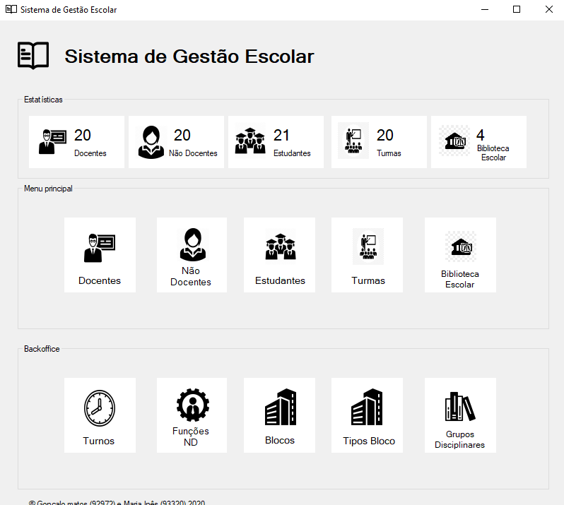

# System for high school administrative management

This project was developed in the context of [Databases](https://www.ua.pt/en/uc/2238) curricular unit, part of the Computer Science Bachelor at [Aveiro University](https://www.ua.pt/). It was lectured by [Carlos Costa](https://www.ua.pt/en/p/10322010) and assisted by [Joaquim Pinto](https://www.ua.pt/en/p/10312245) during the 2019/2020 school year.

It was graded **17 out of 20**.

> See a demo video by clicking on the image above.

## About the project

This project was designed for a teaching environment to ease the process of school management, integrating not only the human resources, assigning people with their roles with scheduling (students and teachers with classes and other employees with tasks), but also a library control system, that maintains the books catalog and allows the management of requisitions.

## Technology stack

The project main goal was to apply the knowledge about relational databases acquired in  the curricular unit, so we focused a lot on **database design**, making **SQL queries,** **stored procedures** and **triggers**.

The interface was developed with Windows Forms and the language we used was **C#**.

## Report

The report is available (in Portuguese) [here](Files/report.pdf).

## Authors

[Gonçalo Matos](https://github.com/gmatosferreira)

[Maria Rocha](https://github.com/Mariainesrocha)

